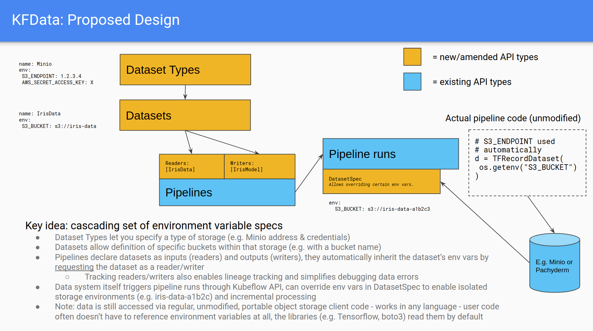

# kfdata
Prototype implementation of KFData proposal - see [bit.ly/kfdata](https://bit.ly/kfdata)

# Design

# Implementation

* Try using Admission Controllers to minimize changes needed to KFP
  * Create operator for CRDs for Dataset Types, Datasets; admission controller to process compiled Argo pipelines to add env vars as v1
* Likely end up using MLMD
  * Treat each Dataset as an Artifact
* Hopefully reuse work across TFX/KFData efforts
  * We recognize that TFX has some similarities, but don’t want to force users to rewrite their pipelines in TFX DSL to take advantage of KFData
  * NB: added TFX section to proposal doc
* In 4-6 weeks, we’ll bring a POC & demo to this WG
  * Target delivery for inclusion and promotion in Kubeflow 1.2 -- if this WG is supportive?
